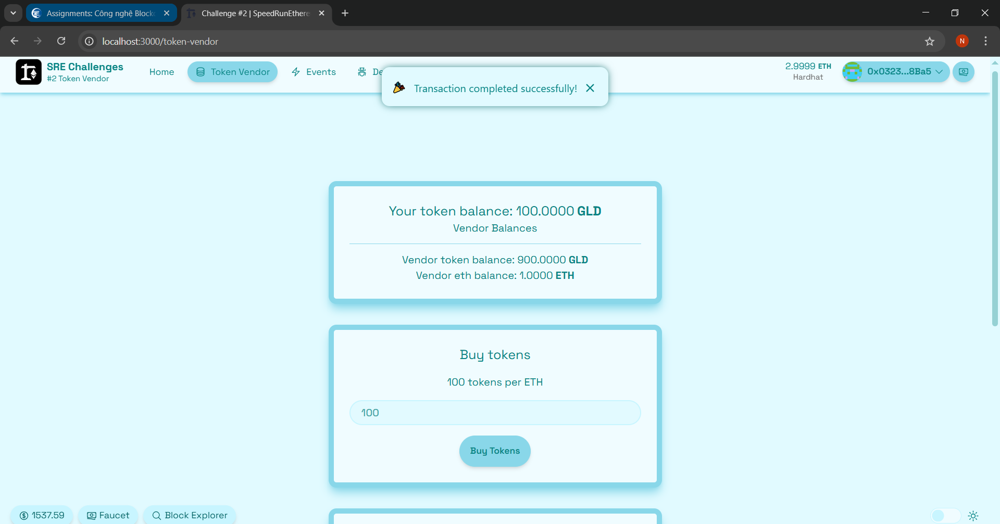
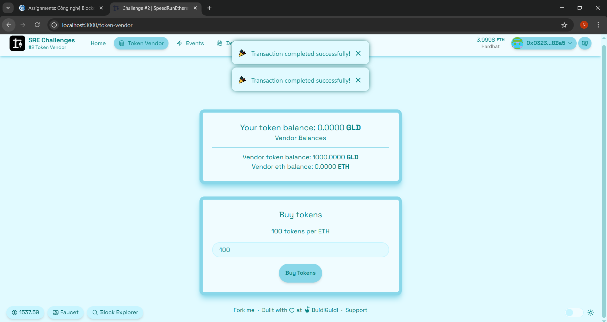
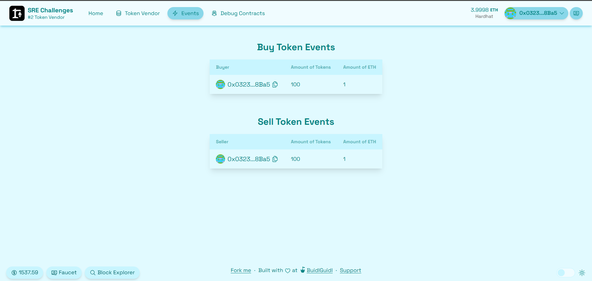
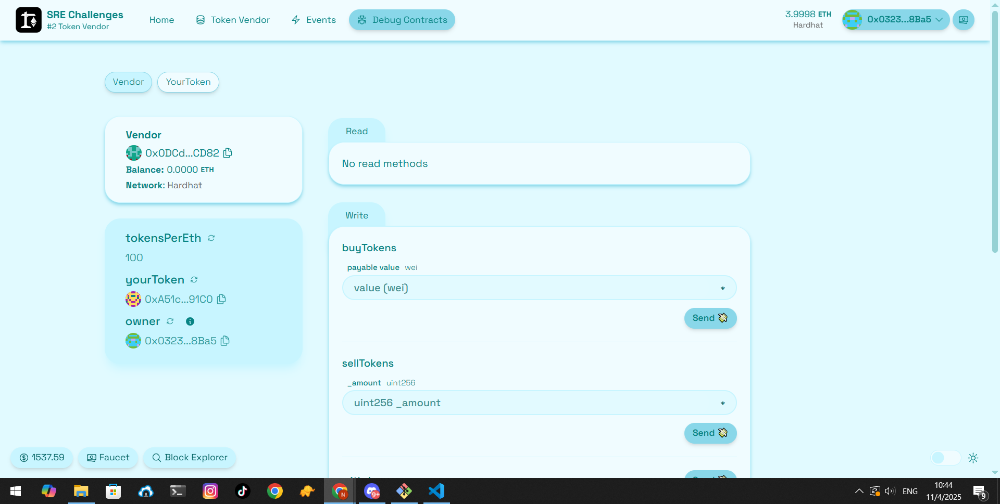
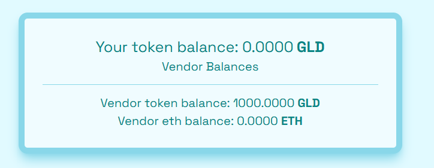

# 📝 Báo Cáo Thử Thách Token Vendor

Dưới đây là các câu trả lời cho các checkpoint trong thử thách "Token Vendor" từ repository [Scaffold-ETH SE-2 Challenges](https://github.com/scaffold-eth/se-2-challenges/tree/challenge-2-token-vendor).

---

## ✅ Checkpoint 1: Triển khai hợp đồng ERC20

### Goal 1: Tạo và triển khai hợp đồng ERC20

- **Tên hợp đồng**: `MyToken`

#### Mã nguồn:

```
pragma solidity 0.8.20; //Do not change the solidity version as it negatively impacts submission grading
// SPDX-License-Identifier: MIT

import "@openzeppelin/contracts/token/ERC20/ERC20.sol";

// learn more: https://docs.openzeppelin.com/contracts/4.x/erc20

contract YourToken is ERC20 {
    constructor() ERC20("Gold", "GLD") {
        _mint(0xf39Fd6e51aad88F6F4ce6aB8827279cffFb92266, 1000 * 10 ** 18);
    }
}
```

---

## ✅ Checkpoint 2: Tạo hợp đồng Token Vendor

### Goal 2.1: Tạo hợp đồng Token Vendor

- **Chức năng**: Hợp đồng Token Vendor cho phép người dùng mua token bằng ETH và bán token để nhận lại ETH.

#### Mã nguồn:

```
pragma solidity 0.8.20; //Do not change the solidity version as it negatively impacts submission grading
// SPDX-License-Identifier: MIT

import "@openzeppelin/contracts/access/Ownable.sol";
import "./YourToken.sol";

contract Vendor is Ownable {
    event BuyTokens(address buyer, uint256 amountOfETH, uint256 amountOfTokens);
    event SellTokens(address seller, uint256 amountOfTokens, uint256 amountOfETH);

    YourToken public yourToken;
    uint256 public tokensPerEth = 100;

    constructor(address tokenAddress) Ownable(msg.sender) {
        yourToken = YourToken(tokenAddress);
    }

    // ToDo: create a payable buyTokens() function:
    function buyTokens() external payable {
        require(msg.value > 0, "You need to send some ether");

        uint256 amountOfTokens = msg.value * tokensPerEth;
        require(yourToken.balanceOf(address(this)) >= amountOfTokens, "Not enough tokens in the reserve");

        yourToken.transfer(msg.sender, amountOfTokens);
        emit BuyTokens(msg.sender, msg.value, amountOfTokens);
    }

    // ToDo: create a withdraw() function that lets the owner withdraw ETH
    function withdraw() external onlyOwner {
        uint256 balance = address(this).balance;
        require(balance > 0, "No ether to withdraw");

        (bool success, ) = msg.sender.call{ value: balance }("");
        require(success, "Transfer failed");
    }

    // ToDo: create a sellTokens(uint256 _amount) function:
    function sellTokens(uint256 _amount) external {
        require(_amount > 0, "You need to sell at least some tokens");
        require(yourToken.balanceOf(msg.sender) >= _amount, "You don't have enough tokens");

        uint256 amountOfETH = _amount / tokensPerEth;
        require(address(this).balance >= amountOfETH, "Not enough ether in the reserve");

        yourToken.transferFrom(msg.sender, address(this), _amount);
        payable(msg.sender).transfer(amountOfETH);
        emit SellTokens(msg.sender, _amount, amountOfETH);
    }
}

```

### Goal 2.2: Tích hợp chức năng mua và bán token

- **Kết quả**: Hợp đồng hoạt động đúng, cho phép mua và bán token.

#### Ảnh minh họa:





---

## ✅ Checkpoint 3: Tích hợp giao diện người dùng

### Goal 3.1: Tích hợp giao diện người dùng để mua và bán token

- **Tích hợp giao diện**: Đã hoàn thành.
- **Chức năng**: Người dùng có thể mua token bằng cách nhập số lượng ETH và bán token bằng cách nhập số lượng token.
- **Kết quả**: Giao diện hoạt động đúng như mong đợi.

#### Ảnh minh họa:

## 

## 🛠 Sidequests

### Sidequest 1: Hiển thị số dư token của người dùng

- **Kết quả**: Đã hiển thị số dư token của người dùng trên giao diện.

#### Ảnh minh họa:



### Sidequest 2: Hiển thị số dư ETH của người dùng

- **Kết quả**: Đã hiển thị số dư ETH của người dùng trên giao diện.

#### Ảnh minh họa:

## 
